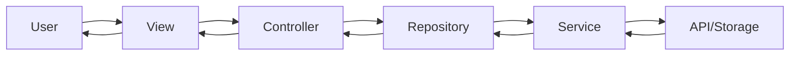
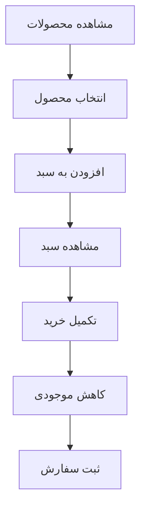
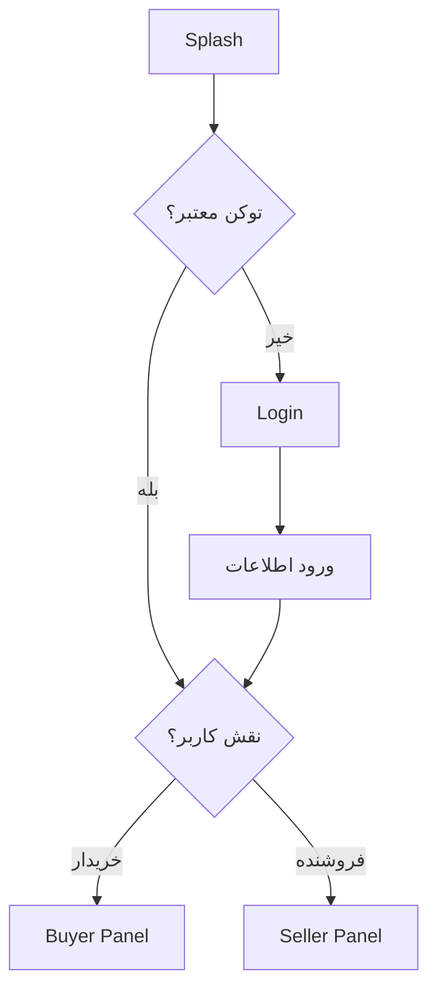

# 🛍️ tavvStore - پلتفرم فروشگاهی دوطرفه

> پروژه ارزیابی فنی شرکت **تاو سیستم**

یک اپلیکیشن فروشگاهی کامل با Flutter که شامل **پنل خریدار** و **پنل فروشنده** در یک برنامه واحد است.

---

## 📸 اسکرین‌شات‌ها

<table>
  <tr>
    <td width="50%">
      
    </td>
    <td width="50%">
      
    </td>
  </tr>
  <tr>
    <td width="50%">
      
    </td>
    <td width="50%">
      
    </td>
  </tr>
</table>

---

## ✨ ویژگی‌های اصلی

### 👤 پنل خریدار (Buyer Panel)
- ✅ مشاهده و جستجوی محصولات
- ✅ فیلترهای پیشرفته (قیمت، رنگ، موجودی، تگ)
- ✅ جزئیات کامل محصول
- ✅ سبد خرید با محاسبه خودکار قیمت
- ✅ تاریخچه سفارشات
- ✅ مدیریت پروفایل

### 🏪 پنل فروشنده (Seller Panel)
- ✅ داشبورد مدیریتی با آمار فروش
- ✅ افزودن محصول جدید
- ✅ ویرایش و حذف محصولات
- ✅ دیدن آمار فروش هر محصول

### 🔐 احراز هویت
- ✅ ورود و ثبت‌نام
- ✅ Remember Me
- ✅ تفکیک نقش (خریدار/فروشنده)

### 🎨 طراحی
- ✅ Responsive (Desktop + Mobile)
- ✅ چندزبانه (فارسی/انگلیسی)
- ✅ Dark Mode Ready
- ✅ انیمیشن‌های روان

---

## 🏗️ معماری

### الگوی طراحی
```
Feature-First + Clean Architecture + MVVM
```

### ساختار لایه‌ها
```
View (UI) → Controller (Logic) → Repository (Data) → Service (API/Storage)
```

### State Management
- **GetX** برای مدیریت State، Navigation و Dependency Injection

---

## 📂 ساختار پروژه

```
taav_store/
├── lib/                          # کتابخانه اصلی (خالی)
│
├── example/                      # برنامه اصلی
│   ├── lib/
│   │   ├── main.dart
│   │   └── src/
│   │       ├── commons/          # ابزارهای مشترک
│   │       ├── infoStructure/    # پیکربندی اصلی
│   │       └── pages/            # صفحات
│   │
│   └── pubspec.yaml              # وابستگی‌های example
│
├── backend/                      # سرور Mock API
│   ├── server.js                 # سرور Node.js + Multer
│   ├── db.json                   # دیتابیس JSON
│   ├── package.json              # وابستگی‌ها
│   ├── package-lock.json         
│   └── public/
│       └── images/               # تصاویر آپلود شده
│
├── test/                         # تست‌ها
└── README.md                     # مستندات
```

هر فیچر شامل:
```
feature/
├── commons/          # Bindings
├── controllers/      # منطق
├── models/           # مدل‌ها
├── repository/       # دسترسی به داده
├── view/             # UI
└── widgets/          # کامپوننت‌ها
```

> **نکته:** سرور با استفاده از `json-server` برای REST API و `multer` برای آپلود فایل پیاده‌سازی شده است.

---

## 🔄 جریان داده



---

## 🛠️ تکنولوژی‌ها

### Frontend
| تکنولوژی | نسخه | استفاده |
|----------|------|----------|
| **Flutter** | 3.x | Framework اصلی |
| **Dart** | 3.x | زبان برنامه‌نویسی |
| **GetX** | ^4.7.3 | State Management + Navigation + DI |
| **Dio** | ^5.9.0 | HTTP Client |
| **get_storage** | ^2.1.1 | ذخیره‌سازی لوکال |
| **either_dart** | ^1.0.0 | Error Handling |
| **flutter_colorpicker** | ^1.1.0 | انتخاب رنگ |
| **image_picker** | ^1.2.1 | انتخاب تصویر |

### Backend (Mock API)
| تکنولوژی | استفاده |
|----------|----------|
| **Node.js** | Runtime سرور |
| **json-server** | REST API Mock |
| **Multer** | آپلود تصویر |
| **CORS** | دسترسی از Flutter |

---

## 📦 پکیج شمارنده محصول

یک پکیج مستقل برای شمارش و کنترل تعداد محصولات ساخته شده است:

🔗 **[advanced_count_control](https://github.com/DanialYazdanParast/advanced_count_control)**

### نصب:
```yaml
dependencies:
  advanced_count_control:
    git:
      url: https://github.com/DanialYazdanParast/advanced_count_control.git
```

### استفاده:
```dart
AdvancedCountControl(
  initialValue: 1,
  minValue: 0,
  maxValue: 10,
  onChanged: (value) {
    print('تعداد: $value');
  },
)
```

---

## 🚀 نحوه اجرا

### پیش‌نیازها
- **Flutter SDK** (نسخه 3.0 یا بالاتر)
- **Node.js** (نسخه 14 یا بالاتر)
- **npm** یا **yarn**

---

### 1️⃣ راه‌اندازی Backend

#### کلون پروژه
```bash
git clone https://github.com/DanialYazdanParast/taav_store.git
cd taav_store/backend
```

#### نصب وابستگی‌ها
```bash
npm install
```

#### اجرای سرور
```bash
node server.js
```

سرور روی پورت `3000` اجرا می‌شود:
```
✅ Server running at http://localhost:3000
```

#### دسترسی از گوشی (USB Debugging)
اگر می‌خواهید از طریق گوشی متصل به کامپیوتر به سرور دسترسی داشته باشید:
```bash
adb reverse tcp:3000 tcp:3000
```

> **نکته:** قبل از اجرای دستور بالا، مطمئن شوید USB Debugging در گوشی فعال است.

---

### 2️⃣ راه‌اندازی Flutter App

#### ورود به پوشه example
```bash
cd ../example
```

#### نصب وابستگی‌های Flutter
```bash
flutter pub get
```

#### اجرای برنامه
```bash
flutter run
```

#### اجرای تست‌ها (از روت پروژه)
```bash
cd ..
flutter test
```

---

### 🔐 اطلاعات ورود پیش‌فرض

#### حساب فروشنده
```
Username: admin
Password: Admin@123
```

#### حساب خریدار
```
Username: buyer1
Password: Buyer@123
```

---

## 🗄️ ساختار دیتابیس (db.json)

### Users
```json
{
  "id": "string",
  "username": "string",
  "password": "string",
  "userType": "buyer | seller"
}
```

### Products
```json
{
  "id": "string",
  "title": "string",
  "description": "string",
  "quantity": "number",
  "price": "number",
  "discountPrice": "number",
  "image": "string (URL)",
  "colors": ["array of hex colors"],
  "tags": ["array of strings"],
  "sellerId": "string"
}
```

### Orders
```json
{
  "buyerId": "string",
  "totalPrice": "number",
  "date": "ISO string",
  "items": [
    {
      "productId": "string",
      "productTitle": "string",
      "sellerId": "string",
      "color": "string",
      "quantity": "number",
      "price": "number",
      "originalPrice": "number",
      "image": "string"
    }
  ]
}
```

### Colors & Tags
رنگ‌ها و تگ‌ها به صورت پیش‌فرض در دیتابیس موجود هستند و قابل افزودن/ویرایش توسط فروشنده می‌باشند.

---

## 📊 دیاگرام‌های کلیدی

### فرآیند خرید


### احراز هویت


---

## 🎯 ویژگی‌های پیشرفته پیاده‌سازی شده

### ✅ مدیریت نقش‌ها
- تفکیک کامل پنل خریدار و فروشنده
- کنترل دسترسی بر اساس Role
- مسیریابی مبتنی بر نقش کاربر

### ✅ سبد خرید پویا
- محاسبه خودکار قیمت نهایی
- کنترل موجودی در زمان واقعی
- ذخیره‌سازی ریموت و همگام‌سازی

### ✅ فیلترهای پیشرفته
- فیلتر بر اساس قیمت (Range Slider)
- فیلتر چندگانه رنگ
- فیلتر موجودی
- فیلتر تگ (دسته‌بندی)
- ترکیب همزمان چند فیلتر

### ✅ آمار فروشنده
- تعداد کل سفارشات
- محاسبه دقیق درآمد
- لیست محصولات پرفروش
- نمودار آماری فروش

### ✅ مدیریت محصول
- آپلود تصویر محصول
- افزودن چند رنگ
- تگ‌گذاری دینامیک
- اعمال تخفیف

---

## 📱 صفحات پیاده‌سازی شده

### عمومی
- ✅ Splash Screen با انیمیشن
- ✅ Login با اعتبارسنجی
- ✅ Register با انتخاب نقش
- ✅ 404 Not Found

### خریدار (Buyer)
- ✅ لیست محصولات با فیلتر پیشرفته
- ✅ جزئیات محصول با گالری تصویر
- ✅ سبد خرید با محاسبه قیمت
- ✅ تاریخچه سفارشات
- ✅ پروفایل کاربری

### فروشنده (Seller)
- ✅ داشبورد با آمار کامل
- ✅ لیست محصولات شخصی
- ✅ افزودن محصول جدید
- ✅ ویرایش محصول
- ✅ آمار فروش تفصیلی
- ✅ پروفایل فروشنده

---

## 🐛 عیب‌یابی

### مشکل اتصال به سرور
```bash
# بررسی وضعیت سرور
curl http://localhost:3000

# بررسی پورت در حال استفاده
netstat -ano | findstr :3000  # Windows
lsof -i :3000                 # macOS/Linux
```

### مشکل دسترسی از گوشی
```bash
# اطمینان از اتصال USB Debugging
adb devices

# تنظیم مجدد Port Forwarding
adb reverse --remove tcp:3000
adb reverse tcp:3000 tcp:3000
```

### خطای وابستگی‌های Flutter
```bash
flutter clean
flutter pub get
flutter run
```

---

## 🚧 در حال توسعه

- [ ] پرداخت آنلاین
- [ ] نوتیفیکیشن Push
- [ ] چت بین خریدار و فروشنده
- [ ] سیستم امتیازدهی و نظرات
- [ ] پنل ادمین مستقل

---

## 📝 لایسنس

این پروژه تحت لایسنس MIT منتشر شده است - برای جزئیات بیشتر فایل [LICENSE](LICENSE) را مشاهده کنید.

---

## 👨‍💻 توسعه‌دهنده

**دانیال یزدان پرست**

- 🔗 GitHub: [@DanialYazdanParast](https://github.com/DanialYazdanParast)
- 📧 Email: danialyazdan77@gmail.com
- 💼 LinkedIn: [دانیال یزدان پرست](https://linkedin.com/in/danialyazdanparast)

---

## 🙏 تشکر

این پروژه به عنوان بخشی از فرآیند ارزیابی فنی **شرکت تاو سیستم** توسعه داده شده است.

**تاو سیستم** - پیشرو در تولید و عرضه نرم‌افزارهای نوآورانه  
🌐 [taavsys.com](https://taavsys.com)

---

## 🌟 ستاره‌دهی

اگر این پروژه برای شما مفید بود، لطفاً با دادن ⭐ از آن حمایت کنید!

---

**ساخته شده با ❤️ در ایران**
