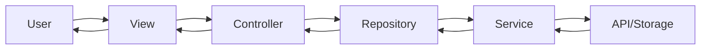
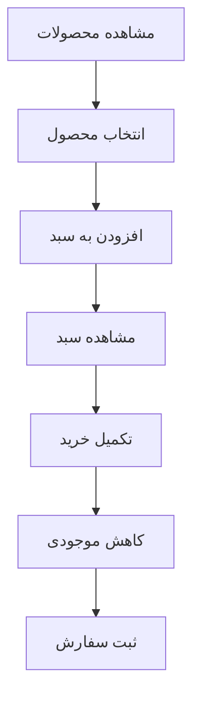
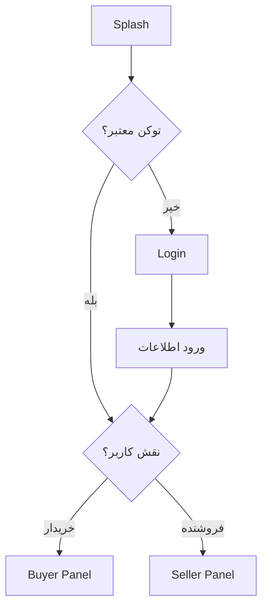

# 🛍️ tavvStore - پلتفرم فروشگاهی دوطرفه

> پروژه ارزیابی فنی شرکت **تاو سیستم**

یک اپلیکیشن فروشگاهی کامل با Flutter که شامل **پنل خریدار** و **پنل فروشنده** در یک برنامه واحد است.

---

## 📸 اسکرین‌شات‌ها


---

## ✨ ویژگی‌های اصلی

### 👤 پنل خریدار (Buyer Panel)
- ✅ مشاهده و جستجوی محصولات
- ✅ فیلترهای پیشرفته (قیمت، رنگ، موجودی، تگ)
- ✅ جزئیات کامل محصول
- ✅ سبد خرید با محاسبه خودکار قیمت
- ✅ تاریخچه سفارشات
- ✅ مدیریت پروفایل

### 🏪 پنل فروشنده (Seller Panel)
- ✅ داشبورد مدیریتی با آمار فروش
- ✅ افزودن محصول جدید
- ✅ ویرایش و حذف محصولات
- ✅ مدیریت موجودی
- ✅ نمودارهای آماری

### 🔐 احراز هویت
- ✅ ورود و ثبت‌نام
- ✅ Remember Me
- ✅ تفکیک نقش (خریدار/فروشنده)
- ✅ مدیریت توکن امن

### 🎨 طراحی
- ✅ Responsive (Desktop + Mobile)
- ✅ چندزبانه (فارسی/انگلیسی)
- ✅ Dark Mode Ready
- ✅ انیمیشن‌های روان

---

## 🏗️ معماری

### الگوی طراحی
```
Feature-First + Clean Architecture + MVVM
```

### ساختار لایه‌ها
```
View (UI) → Controller (Logic) → Repository (Data) → Service (API/Storage)
```

### State Management
- **GetX** برای مدیریت State، Navigation و Dependency Injection

---

## 📂 ساختار پروژه

```
lib/
├── main.dart
└── src/
    ├── commons/              # ابزارهای مشترک
    │   ├── constants/        # ثابت‌ها
    │   ├── services/         # سرویس‌های پایه
    │   └── widgets/          # ویجت‌های عمومی
    │
    ├── infoStructure/        # پیکربندی اصلی
    │   ├── di/               # Dependency Injection
    │   ├── routes/           # مسیریابی
    │   ├── theme/            # تم و رنگ‌ها
    │   └── languages/        # چندزبانگی
    │
    └── pages/                # صفحات
        ├── auth/             # ورود و ثبت‌نام
        ├── buyer/            # پنل خریدار
        ├── seller/           # پنل فروشنده
        ├── shared/           # مشترک
        └── splash/           # صفحه اسپلش
```

هر فیچر شامل:
```
feature/
├── commons/          # Bindings
├── controllers/      # منطق
├── models/           # مدل‌ها
├── repository/       # دسترسی به داده
├── view/             # UI
└── widgets/          # کامپوننت‌ها
```

---

## 🔄 جریان داده



---

## 🛠️ تکنولوژی‌ها

| تکنولوژی | استفاده |
|----------|----------|
| **Flutter 3.x** | Framework اصلی |
| **Dart 3.x** | زبان برنامه‌نویسی |
| **GetX** | State Management + DI + Navigation |
| **Dio** | HTTP Client |
| **get_storage** | ذخیره‌سازی لوکال |

---

## 📦 پکیج شمارنده محصول

یک پکیج مستقل برای شمارش و کنترل تعداد محصولات ساخته شده است:

🔗 **[advanced_count_control](https://github.com/DanialYazdanParast/advanced_count_control)**

### نصب:
```yaml
dependencies:
  advanced_count_control:
    git:
      url: https://github.com/DanialYazdanParast/advanced_count_control.git
```

### استفاده:
```dart
AdvancedCountControl(
  initialValue: 1,
  minValue: 0,
  maxValue: 10,
  onChanged: (value) {
    print('تعداد: $value');
  },
)
```

---

## 🚀 نحوه اجرا

### 1. کلون پروژه
```bash
git clone https://github.com/DanialYazdanParast/taav_store.git
cd taav_store
```

### 2. نصب وابستگی‌ها
```bash
flutter pub get
```

### 3. اجرای برنامه
```bash
flutter run
```

### 4. اجرای تست‌ها
```bash
flutter test
```

---

## 📊 دیاگرام‌های کلیدی

### فرآیند خرید


### احراز هویت


---

## 🎯 ویژگی‌های پیشرفته پیاده‌سازی شده

### ✅ مدیریت نقش‌ها
- تفکیک کامل پنل خریدار و فروشنده
- کنترل دسترسی بر اساس Role

### ✅ سبد خرید پویا
- محاسبه خودکار قیمت نهایی
- کنترل موجودی در زمان واقعی
- ذخیره‌سازی لوکال

### ✅ فیلترهای پیشرفته
- فیلتر بر اساس قیمت (Range)
- فیلتر رنگ
- فیلتر موجودی
- فیلتر تگ (دسته‌بندی)

### ✅ آمار فروشنده
- نمودار فروش
- تعداد سفارشات
- محاسبه درآمد
- محصولات پرفروش

---

## 📱 صفحات پیاده‌سازی شده

### عمومی
- ✅ Splash Screen
- ✅ Login
- ✅ Register
- ✅ 404 Not Found

### خریدار
- ✅ لیست محصولات (با فیلتر)
- ✅ جزئیات محصول
- ✅ سبد خرید
- ✅ تاریخچه سفارشات
- ✅ پروفایل

### فروشنده
- ✅ داشبورد
- ✅ لیست محصولات
- ✅ افزودن محصول
- ✅ ویرایش محصول
- ✅ آمار فروش
- ✅ پروفایل

---


## 👨‍💻 توسعه‌دهنده

**[دانیال یردان پرست]**
- GitHub: [@DanialYazdanParast](https://github.com/DanialYazdanParast)
- Email: danialyazdan77@gmail.com

---


## 🙏 تشکر

این پروژه به عنوان بخشی از فرآیند ارزیابی فنی **تاو سیستم** توسعه داده شده است.

**تاو سیستم** 
🌐 [taavsys.com](https://taavsys.com)
